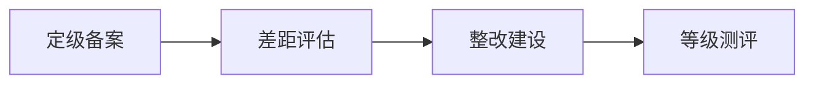

## 等级保护工作流程



**根据流程**：公司提交资料申请定级，由 公安部门监管的测评机构对公司进行评测，在公司能力薄弱的情况下，会找到安全厂商出整改方案，最终公司整改完成，由公安部给出通知


### **对等保的认知**：

**等级测评并非安全认证 **

等保测评 并非相当于 ISO 20000系列的信息技术服务管理认证

也并非于ISO27000系列的信息安全管理体系认证


**公司不同业务可以根据是否核心业务来定不同的等级**


**定级时间**：二级信息系统未明确测评时间（一般是两年一次），三级信息系统明确规定每年测评一次，四级信息系统每半年测评一次，五级信息系统虽有要求但在实际工作中几乎很难遇到。


**等级保护测评没有相应的证书** 【一般是没有正式证书的，就是 邮件、或者打印一张纸 告知下过了  就没了】

如何才能证明信息系统已经符合等级保护安全要求了呢？目前这主要是由公安部授权委托的全国一百多家测评机构，对信息系统进行安全测评，测评通过后出具《等级保护测评报告》，拿到了符合等保安全要求的测评报告就证明该信息系统符合了等级保护的安全要求

 

**等保制度基本要求**

几乎没有任何一个被测系统能全部满足等保要求。一般情况下，目前等级保护测评过程中，只要**没发现高危安全风险**，都可以通过测评。但是，安全是一个动态而非静止的过程，而不是通过一次测评，就可以一劳永逸的


**内网系统也需要等级测评**

OA、门户 二级系统


**系统托管、上云也需要测评**


**系统备案场所**

目前有些单位的注册地跟运营地不一致，正常情况下需要去**运营地区**的网安部门办理备案手续。

这种情况下，云系统应当在系统实际运维团队所在地市网安部门进行系统**备案**


**等保测评不一定花很多钱**

安全制度完善、安全加固、安全设备的添置 只要做好就有可能不花钱，花钱是因为找第三方平台了

安全设备：比如说使用安全狗

日志审计：ELK


###  等保2.0 和1.0 的区别：


### 1. 定级备案


收费：2w?

准备几个表格：打印提交给网监部门，具体提交到哪里，可以问下机构【找谁做的等保】

- 定级备案表1--等保备案单位模板2019.doc 

- 定级备案表2--等保备案系统模板2019.doc（每个系统1个word文档）

- 定级备案表3--信息系统定级专家评审意见表.docx

- 定级备案表4--等保工作小组名单模板.xlsx
- 定级备案表5--安全产品清单&销售许可证明清单.xlsx
- 定级备案表6--定级报告模版.doc（每个系统1个word文档）
- 定级备案表7--定级备案系统的系统网址或IP地址.doc
- 定级备案表8--公司简介
- 补充：**架构图**【在一二表中不同的定级可能还会有输出公司的**架构图**】

```
# 其他的人的流程：

1、请提供单位备案表、系统备案表（每个系统1个word文档）、等保工作小组名单、定级报告（每个系统1个word文档）、定级备案系统的系统网址或IP地址资料。
2、上述材料电子版发88553262@qq.com审核后打印纸质材料。
3、纸质材料除了系统备案表一式两份，其余的一份，均加盖备案单位公章，送至信安路交警支队8楼管理大队。
4、如系统定级为三级或以上，需提供以下材料：系统拓扑结构及说明、	系统安全组织机构及管理制度、系统安全保护设施设计实施方案或改建实施方案、使用的安全产品清单及认证、销售许可证明。（在系统备案表模板内已有相应说明）。
5、2019年12月1日后开展备案需提供专家评审资料（以上级主管部门和同行评审为主，内容为评审系统定级是否准确，具体细则待定）。
7、测评机构对备案信息系统进行测评。
6、如备案的系统为网站，根据法律法规要求，需登录http://www.beian.gov.cn/portal/index.do，线上进行公安备案。
```


###  2. 差距评估


###  3. 整改建设 

安全策略

安全加固

安全管理制度

安全设备采购部署

###  4.等级测评

70 > 才基本符合（才是过了）

100 是符合


#  QITA

iso27001


等保从十个方面对安全进行描述：

安全物理环境

安全通信网络

安全区域边界

安全计算环境

安全管理中心

安全管理制度

安全管理机构

安全管理人员

安全建设管理

安全运维管理